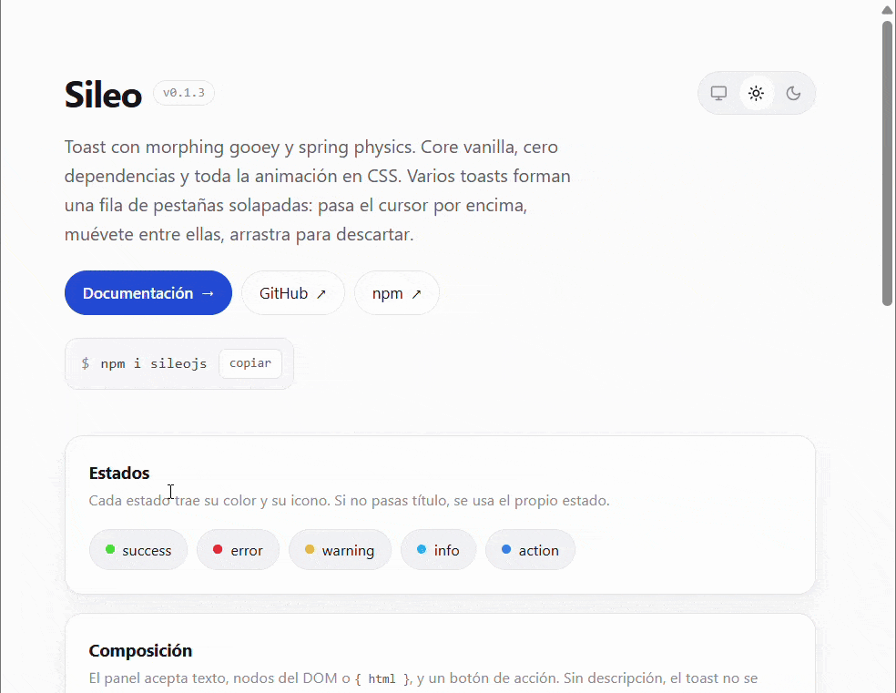

# Sileo (vanilla JS)

**English** · [Español](README.es.md)

[](https://www.npmjs.com/package/sileojs)
[](LICENSE)
[](https://www.npmjs.com/package/sileojs?activeTab=dependencies)



**[Docs](https://dinnger.github.io/sileojs/docs/en.html)** · **[Documentación en español](https://dinnger.github.io/sileojs/docs/)** · **[Demo](https://dinnger.github.io/sileojs/demo/)** · **[npm](https://www.npmjs.com/package/sileojs)** · **[GitHub](https://github.com/dinnger/sileojs)**

A rewrite of [sileo.aaryan.design](https://sileo.aaryan.design/) — toasts with
gooey morphing and spring physics — rebuilt as a **vanilla core with zero
dependencies** that works with any JS framework. Ships a Vue 3 adapter.

The original is React + [`motion`](https://motion.dev). Here **all the animation
lives in CSS**: the spring is a native `linear()` easing and the geometry is
resolved with `calc()` / `max()` over custom properties. JS only keeps state,
builds the DOM, measures two things (pill width and panel height), places the
tabs in the row and runs the timers.

```
src/sileo.css   animation engine (spring, morph, gooey, themes)
src/sileo.js    vanilla core — store + renderer + API
src/vue.js      Vue 3 adapter (component, plugin, composable)
docs/en.html    full documentation (sidebar, live examples)
docs/index.html the same, in Spanish — the page picks the language from the browser
docs/docs.css   stylesheet and script shared by both languages
docs/docs.js
demo/index.html playground, no build
README.es.md    this same file, in Spanish
```

**[Full documentation →](https://dinnger.github.io/sileojs/docs/en.html)** —
install, usage per framework, API reference, CSS variables and accessibility,
with examples you can fire right on the page.

## Install

```bash
npm i sileojs
```

```js
import { sileo, createToaster } from "sileojs";
import "sileojs/styles.css";

createToaster({ position: "top-right", theme: "system" });

sileo.success({ title: "Saved", description: "Your changes were synced." });
```

`createToaster()` is optional: the first `sileo.*()` mounts a toaster with the
defaults.

## Vue 3

```vue
<script setup>
import { SileoToaster } from "sileojs/vue";
import { sileo } from "sileojs";
import "sileojs/styles.css";
</script>

<template>
  <SileoToaster position="top-right" theme="system" />
  <button @click="sileo.success({ title: 'Done' })">Save</button>
</template>
```

### No component (plugin + global `$sileo`)

The plugin mounts the toaster on boot and makes `$sileo` available in every
template, so you never place `<SileoToaster />` anywhere nor import anything in
each component:

```js
// main.js
import { createApp } from "vue";
import { SileoPlugin } from "sileojs/vue";
import "sileojs/styles.css";
import App from "./App.vue";

createApp(App)
  .use(SileoPlugin, {
    position: "top-right",
    theme: "light",
    options: { roundness: 14, styles: { toast: "top-90" } },
  })
  .mount("#app");
```

```vue
<template>
  <button @click="$sileo.success({ title: 'Saved' })">Save</button>
</template>
```

`$sileo` only exists inside the template (it is a `globalProperty`). In
`<script setup>` use `import { sileo } from "sileojs"` or `inject("sileo")`.

Pass `{ mount: false }` if you would rather mount the toaster yourself (or use
the component).

### Theme, position and styles on the fly

`useSileoConfig()` returns a **reactive** object shared by the whole app.
Mutating it reconfigures the toaster live, including the toasts already on
screen:

```vue
<script setup>
import { useSileoConfig } from "sileojs/vue";

const cfg = useSileoConfig();

const dark  = () => (cfg.theme = "dark");
const below = () => (cfg.position = "bottom-center");
const big   = () => (cfg.styles.title = "text-lg font-bold");
</script>
```

| Field | What it is |
| --- | --- |
| `cfg.position` | one of the 6 positions |
| `cfg.theme` | `light \| dark \| system` |
| `cfg.offset` | number/string or `{ top, right, bottom, left }` |
| `cfg.visibleToasts` | tabs visible in the stack |
| `cfg.options` | defaults for every toast (`roundness`, `duration`…) |
| `cfg.styles` | per-part styles (see [Per-part styles](#per-part-styles)) |

In templates it is also available as `$sileoConfig`, and the component takes the
same things as props:

```vue
<SileoToaster position="top-right" theme="light" :styles="{ toast: 'top-90' }" />
```

## Other frameworks

The core knows nothing about frameworks. The pattern is always the same:

```js
// React
useEffect(() => {
  const toaster = createToaster({ position: "top-right" });
  return () => toaster.destroy();
}, []);

// Svelte
onMount(() => {
  const toaster = createToaster({ position: "top-right" });
  return () => toaster.destroy();
});

// Angular / vanilla
ngOnInit()   { this.toaster = createToaster(); }
ngOnDestroy(){ this.toaster.destroy(); }
```

`destroy` uses `this`, so call it on the toaster (`() => toaster.destroy()`)
rather than passing it bare as a callback.

Changing theme, position or styles on the fly needs neither the toaster instance
nor an adapter: `configure()` (or the `sileo` shorthands) reaches it from
anywhere.

```js
import { configure, sileo } from "sileojs";

configure({ theme: "dark" });                     // or sileo.setTheme("dark")
configure({ position: "bottom-center" });         // or sileo.setPosition(...)
configure({ styles: { toast: "top-90" } });       // or sileo.setStyles(...)
sileo.getConfig();                                // the current config
```

Everything applies live: the toasts already on screen switch theme, move to the
new position and repaint with the new styles.

The demo (`demo/index.html`) carries the same example for each framework in
tabs.

## API

### `sileo`

| Method | Description |
| --- | --- |
| `sileo.show(opts)` | Uses `opts.type` as the state |
| `sileo.success/error/warning/info/action/loading(opts)` | Shorthands per state |
| `sileo.promise(promise \| () => promise, opts)` | `loading` → `success` / `error` / `action` |
| `sileo.update(id, opts)` | Mutates a live toast (collapses, swaps, reopens) |
| `sileo.dismiss(id)` | Animated exit |
| `sileo.clear(position?)` | Clears everything, or one position |
| `sileo.configure(opts)` | Reconfigures the toaster live (mounts it if missing) |
| `sileo.setTheme / setPosition / setStyles(v)` | `configure` shorthands |
| `sileo.getConfig()` | The current config (or `null` with no toaster) |

They return the toast's `id` (`"sileo-default"` by default, so repeated calls
**replace** the same toast; pass your own `id` to stack them).

### Toast options

| Option | Type | Default |
| --- | --- | --- |
| `title` | `string` | the state |
| `description` | `string \| Node \| { html }` | — |
| `type` / `state` | `success \| loading \| error \| warning \| info \| action` | `success` |
| `position` | one of the 6 positions | the toaster's |
| `duration` | `number \| null` (`null` = it stays) | `6000` |
| `icon` | `string \| Node \| { html }` | the state's icon |
| `styles` | per-part styles, see [Per-part styles](#per-part-styles) | — |
| `fill` | panel colour | per theme |
| `roundness` | `number` (scales the gooey blur) | `16` |
| `autopilot` | `false \| { expand, collapse }` (ms) | opens at 150ms, closes at 4000ms |
| `button` | `{ title, onClick }` | — |
| `id` | `string` | `"sileo-default"` |

### Toaster options

`position`, `theme` (`light \| dark \| system`), `offset` (number/string or
`{ top, right, bottom, left }`), `options` (defaults for every toast), `styles`
(shorthand for `options.styles`), `visibleToasts` (tabs visible in the stack),
`container` (default `document.body`).

The toaster is a single one for the whole page: `createToaster()` returns the
existing one (applying the new options to it). `getToaster()` returns the mounted
one or `null`, and the Vue component uses it to destroy only the one it created.

`toaster.set(opts)` takes the same fields and applies them live. `options` and
`styles` are **merged** with whatever was there; `null` clears them and
`replace: true` swaps them wholesale (that is what the Vue adapter uses, since
it already sends the full state). `toaster.config` returns the current config.

## Per-part styles

`styles` is a **part → style** object. Nothing in it is framework-specific: what
you hand over are classes, CSS properties, or both.

| Part | Node |
| --- | --- |
| `viewport` | the container for that position |
| `toast` | the toast root |
| `canvas`, `pill`, `body` | the gooey layers |
| `header`, `badge`, `title` | the header (the tab itself) |
| `content`, `description`, `button` | the open panel |
| `count` | the `+N` chip |

Three shapes, mixable across parts:

```js
sileo.success({
  title: "Saved",
  description: "All good.",
  styles: {
    toast: "rounded-2xl shadow-lg",              // classes
    description: { color: "#64748b" },           // CSS properties
    badge: { class: "ring-2", style: { "--x": "1" } }, // both
  },
});
```

`camelCase` and `kebab-case` properties work the same, and so do custom
properties (`--sileo-*`), so any CSS variable can be reached from here.

To apply them to **every** toast put them on the toaster — and change them
whenever you like:

```js
createToaster({ position: "top-right", styles: { toast: "top-90" } });

// later on, and it reaches what is already on screen
configure({ styles: { title: "text-lg", toast: null } }); // null drops that part
```

They merge per part and the **toast wins**: if the toaster sets `styles.toast`
and the call does too, the call's value is used. Applying new styles always
removes the previous ones, so swapping them live leaves nothing behind.

## Interaction

- **Hover / focus** → opens the panel and **pauses** the auto-dismiss.
- **Drag** vertically > 30px → dismisses.
- `prefers-reduced-motion` turns off all movement.

## The overlapping tab row

When several toasts share a position they do not stack as a list: they form an
**overlapping row of tabs at the title's height**. The focused tab shows its
icon, its title and its message; the rest shrink to a circle with just the icon
and ride over their neighbour. Nothing drops but the focused one's panel.

- At rest the tabs behind sit on top of one another like a deck, showing only
  their icon. Focus goes to the tab at the screen edge (the newest toast), and a
  new toast takes focus.
- The icon hugs the edge the tab peeks from, which depends on the position: in
  the right-hand ones the row grows inwards and the left side peeks; in the left
  and centre ones, the right side.
- When the pointer comes in the deck opens: **every** notification shows up (the
  cut at three is only for the resting state) and the front tab opens its panel.
- **Only the focused tab widens**; the rest stay as their icon. But it always
  widens to the **same** width, that of the widest in the stack: what it grows
  offsets what it shifts, so the tab you are pointing at does not slip away from
  the pointer. If it took its own width, focusing a short-titled one would bounce
  focus to its neighbour.
- The focused tab keeps its natural `z-index`: below the ones in front of it and
  above the ones behind, like a real tab. Put on top of everything, focusing a
  middle one would swallow the ones between it and the screen edge.
- If the row does not fit the toaster's width, the focused tab's width is
  trimmed first and then how much each icon peeks, rather than overflowing: a tab
  outside the viewport would fall outside the hover area and be unreachable.
- Moving the pointer to another circle jumps focus to that tab: it widens in
  place to show its title, opens its message, pushes the ones behind and the
  previous one goes back to being a circle.
- While the pointer is inside, the `autopilot` stops counting: it will not close
  the panel you are pointing at.
- When the pointer leaves, focus goes back to the front and everything closes.
- At rest 3 tabs are visible (`--sileo-stack-max` / the `visibleToasts` option)
  and, if there are more, a **`+`** shows up at the end of the deck: it only
  tells you there are others; the exact number shows when the row opens. The
  focused tab is never hidden, even as new toasts arrive.

The positions are a single recurrence, from the screen edge inwards:

```
x[0]   = 0
x[i+1] = x[i] + width(i) - tab-overlap
width(i) = (i focused ? its pill's width : the toast's height)
```

The JS publishes `--_tx` (shift along the row), `--_i` (depth in z) and `--_sh`
(stack height); CSS derives the `translate`, the `z-index` and each tab's width
(`--_rw`, which is `--_pw` on the focused one and `--sileo-height` on the rest).
The shift goes on the pill and the header, not on the root, so the panel always
stays glued to the edge. The viewport measures exactly the stack and acts as the
hover area, so moving between tabs never closes it.

## How the CSS works

The original's visual trick is two rectangles and an SVG filter:

1. **pill** (the header capsule) and **body** (the panel) are two `div`s with
   `border-radius`, inside a layer with `filter: url(#sileo-goo-N)`.
2. The filter is `feGaussianBlur` → `feColorMatrix` (alpha ×20 −10): it turns the
   blur into a hard edge, and that is where two nearby shapes **merge**
   (metaballs).
3. The bridge's colour does **not** come from the blur: in unpremultiplied sRGB
   transparent is black, so the bridge came out dark grey. It is flooded with
   `feFlood` (whose `flood-color` is `var(--sileo-fill)`, inherited from the
   toast) and clipped by the thresholded alpha; the `SourceGraphic` goes on top
   so the shapes keep their crisp edge. That is why there is one filter per
   toast.
4. On expanding, the pill grows `blur × 3` downwards to force that overlap.
5. The top edge (`top-*`) reuses the same geometry with `scaleY(-1)`.
6. The shadow goes **after** in the canvas's filter chain
   (`filter: var(--sileo-goo) var(--sileo-shadow)`), so it falls on the already
   merged silhouette. Inside the filter it would be useless: the alpha threshold
   would eat it.

JS only publishes two measurements through `ResizeObserver`:

```
--_pw   pill width     = header scrollWidth + padding + 10
--_ch   content height = panel scrollHeight
```

and CSS derives the rest:

```css
--_exp: max(calc(var(--sileo-height) * 2.25),
            calc(var(--sileo-height) + var(--_ch)));
```

The spring (`bounce: 0.25`) is the `linear()` function in
`--sileo-spring-easing`; on collapse it switches to `--sileo-ease-flat` (no
overshoot), reproducing the original's `bounce: 0`.

## Customising

It is all custom properties:

```css
:root {
  --sileo-width: 380px;
  --sileo-height: 44px;
  --sileo-roundness: 20px;
  --sileo-duration: 500ms;
  --sileo-state-success: oklch(0.72 0.19 150);

  /* tab row */
  --sileo-tab-overlap: 20px;     /* overlap at rest (the deck) */
  --sileo-tab-overlap-hot: 12px; /* overlap with the pointer inside */
  --sileo-stack-max: 3;          /* visible tabs */
  --sileo-gap: 12px;             /* distance from the screen edge */
  --sileo-shadow: drop-shadow(0 2px 8px rgb(0 0 0 / 0.18));
}
```

The shadow depends on the fill, not on taste: it is what separates a tab from the
one behind it. With light capsules a dark shadow is enough; with
`theme: "light"` the capsule is dark and a black shadow over another dark capsule
separates nothing, so there it also gets a light rim. If you change
`--sileo-fill` by hand, adjust `--sileo-shadow` too.

`--sileo-height`, `--sileo-tab-overlap` and `--sileo-stack-max` are declared with
`@property`, so the JS reads them already resolved to px and you can write them
in any unit.

## Tests

Two assertion suites that run in the browser, with no dependencies:

- `demo/spec.html` — the core: stack order, shifts, focus, `z-index`, timers,
  autopilot versus the pointer, dragging and `promise`.
- `demo/spec-vue.html` — the Vue 3 adapter (plugin with global `$sileo`,
  component with `useSileo()`, and that unmounting a component does not take down
  a toaster someone else mounted). Loads Vue from a CDN with an import map.

Open them in the browser: each prints PASS/FAIL and a `TODO OK` at the end.

## Demo

ES modules need a server with the right MIME type (`python -m http.server`
serves `.js` as `text/plain` on Windows and Chrome rejects it):

```bash
npx serve .
# open http://localhost:3000/demo/
```

## Browser support

Chrome/Edge 113+, Safari 16.4+, Firefox 128+ (`linear()`, `oklch()`,
`color-mix()`, `@property`, the `translate`/`scale` properties). No build step,
no dependencies.

Original design: [Aaryan Kapoor](https://github.com/hiaaryan/sileo) · MIT.
